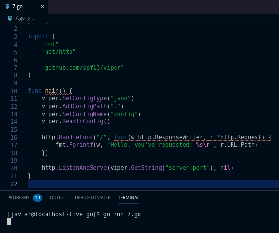

# Tugas-1-Pemrograman-Jaringan
### Javiar Fasyah - 1301164477  

**Jawaban Soal No. 1:**  
  Diagram yang dimaksud adalah diagram TCP three-way handshake, yang terjadi saat client dan server berkomunikasi dalam suatu jaringan.  
  Dari sisi client, hal pertama yang dilakukannya setelah aktif adalah mengirim pesan SYN (synchronize) kepada server. Jika pesan diterima dan server menjawab dengan pesan SYN, ACK (synchronize, acknowledge), maka kedua entitas tersebut sudah membangun koneksi dan siap berkomunikasi. Disaat client menyudahi sesi dengan server (mengirim pesan FIN (finish) dan server menjawab dengan mengirim pesan ACK lalu FIN (atau kebalikannya), maka kedua entitas tersebut resmi terputus koneksinya.  
  Dari sisi server, disaat server sudah siap dan menerima pesan SYN dari client, maka server akan mengrimkan pesan SYN, ACK untuk memulai koneksi dengan client. Setelah mendapat jawaban ACK dari client, koneksi diantara keduanya terbangun dan siap berkomunikasi. Disaat client ingin menyudahi sesi dan mengirim pesan FIN, server akan mengirim pesan ACK lalu mengirim pesan FIN setelah sesi diterminasi. Setelah client menjawab ACK, maka koneksi keduanya resmi terputus.  

**Jawaban Soal. No. 2:**  
  Program pertama adalah tentang berbagai macam sintaks iterasi dalam bahasa Go, output yang dihasilkan adalah “1, 2, 3; 7, 8, 9; loop; 1, 3, 5”. Pada iterasi pertama, variabel di-assign nilai diluar sintaks iterasi, iterasi dilakukan hingga batas yang ditentukan dengan mencetak nilai variabel saat iterasi lalu menambah nilai variabelnya hingga memenuhi batas iterasi. Pada iterasi kedua, nilai iterasi di-assign dalam sintaks beserta penambahan nilai variabelnya, iterasi dilakukan hingga batas yang ditentukan sembari mencetak nilai variabel.  
  Pada iterasi ketiga, terdapat sintaks break yang akan menyudahi iterasi sesuai keinginan (dalam kasus ini setelah mencetak string “loop”). Pada iterasi terakhir, iterasi dilakukan mirip dengan pada iterasi kedua, namun dalam pencetakan nilai variabel terdapat sebuah kondisi dimana jika nilai variabel di-mod 2 sama dengan 0 (bilangan genap), maka pencetakan nilai variabel dilewati (dengan sintaks continue).  
  
  

  Program kedua adalah tentang penulisan sintaks kondisi pada bahasa Go, output yang dihasilkan adalah “7 is odd; 8 is divisible by 4; 9 has 1 digit”. Pada kondisi pertama, terdapat pengecekan nilai 7 dengan di-mod 2, jika hasilnya 0 maka dicetaklah “7 is even”, jika tidak maka dicetak “7 is odd”. Pada kondisi kedua, terdapat kondisi mirip dengan kondisi pertama (jika 8 di-mod 4 adalah 0, maka dicetak “8 is divisible by 4”), namun jika seandainya 8 di-mod 4 bukan 0, maka program tidak akan mencetak apapun. Pada kondisi terakhir, nilai variabel di-assign didalam sintaks kondisi untuk kemudian dibandingkan, jika variabel kurang dari 0 maka dicetak “is negative”, jika variabel kurang dari 10 maka dicetak “has 1 digit”, dan jika bukan kedua-duanya maka dicetak “has multiple digits”.  
  

**Jawaban Soal No. 3:**  
  Program pertama adalah tentang array dalam bahasa Go, output yang dihasilkan adalah “emp” [0 0 0 0 0], set: [0 0 0 0 100], get: 100, len: 5; dcl: [1 2 3 4 5]; 2d: [0 1 2] [1 2 3]”. Array pertama di-assign sebagai array integer dan dicetak saat array masing kosong, lalu array tersebut di-assign nilai 100 pada index ke-4 sehingga saat array dicetak kembali terdapat nilai 100 pada index terkahir, nilai pada index terakhir juga dicetak tersendiri dan panjang dari array dicetak dengan sintaks len. Array kedua juga merupakan array integer yang di-assign langsung dengan nilai pada masing-masing index, sehingga saat dicetak array menampilkan nilai-nilai dari masing-masing index. Array terakhir merupakan array dua dimensi (2 array dengan masing-masing 3 index), array dua dimensi ini di-assign nilainya dengan iterasi bersarang (iterasi didalam iterasi).  
  

  Program kedua adalah tentang fungsi dalam bahasa Go, outputnya adalah “1+2= 3; 1+2+3= 6”. Fungsi pertama adalah fungsi khusus tipe data integer yang akan mengembalikan hasil penambahan dari dua variabel masukan parameter, parameter pada fungsi ini dideklarasikan tipe datanya satu persatu. Fungsi kedua mirip dengan fungsi pertama yang khusus untuk tipe data integer dan mengembalikan hasil penambahan dari tiga variabel parameter, namun parameter pada fungsi dideklarasikan semuanya pada suatu tipe data.  
  

**Jawaban Soal No. 4:**  
  Program pertama adalah tentang tipe data buatan (struct) pada bahasa Go, output yang dihasilkan adalah “{Bob 20}, {Alice 30}, {Fred 0}, &{Ann 40}; Sean, 50, 51”. Tipe data yang dibuat pada program ini adalah tipe data person yang terdiri dari atribut string name dan integer age. Tipe data ini dapat di-assign nilai name dan age-nya dengan lansung memasukan nilai ke parameter tipe data (contoh: person{“Bob”, 20}) atau diperjelas dengan atributnya (contoh: person{name: “Alice”, age: 30}), bisa juga hanya memasukan nilai ke salah satu atributnya  (contoh: person{name: “Fred”}) sehingga atribut yang lain dimasukan nilai default. Selain pencetakan penuh nilai tipe data, nilai dari atribut bisa dipanggil satu persatu dengan urutan tipe datanya lalu atributnya (contoh: memanggil hanya name yakni dengan sintaks person.name). pencetakan atribut bisa dilakukan dengan pointer (variabel merujuk ke variabel lain yang tipe datanya person) dan dari pointer ini bisa diubah nilai tipe datanya.  
  

  Program kedua adalah tentang method (fungsi yang khusus dimiliki sebuah stuct) pada bahasa Go, output yang dihasilkan adalah “area: 50, perim: 30; area: 50, perim: 30”. Method dapat digunakan saat struct sudah diinisialiasi pada suatu variabel dan dipanggil sama dengan cara memangil atribut dari tipe data (contoh: method area( ) pada tipe data rect dipanggil dengan sintaks rect.area( )). Parameter input yang digunakan method merupakan atribut-atribut yang dimiliki tipe data tersebut. Method juga dapat dipanggil oleh variabel pointer yang merujuk ke variabel dengan tipe data pemilik method tersebut.  
  

**Jawaban Soal No. 5:**  
  Program pertama adalah tentang pengembalian nilai lebih dari satu pada bahasa Go, output yang dihasilkan adalah “3, 7; 7”. Pengembalian nilai lebih dari satu ini bisa dilakukan oleh sebuah fungsi, namun cara menerima dari pengembalian nilai lebih dari satu harus dengan cara tuple, dimana terdapat lebih dari satu (sesuai banyak nilai yang dikembalikan funsgi) yang akan menerima nilai dari fungsi tersebut (contoh: fungsi vals( ) memiliki dua nilai yang akan dikembalikan, penerimanya adalah a, b := vals( )). Nilai yang dikembalikan dari fungsi tersebut, dapat diabaikan salah satunya dengan menggunakan _ (underscore) pada tuple (contoh: contoh: fungsi vals( ) memiliki dua nilai yang akan dikembalikan namun nilai pertama diabaikan, maka penerimanya adalah \_\, b := vals( )).  
  

  Program kedua adalah tentang flag (command line) pada bahasa Go, output yang dihasilkan adalah “word tes, numb 5, bool true, svar h, tail: [b b t]”. Flag berfungsi untuk memproses masukan flag saat menjalankan program. Program akan memproses (mencetak nilai dari flag pada program ini) hanya flag yang di-assign nilainya, jika tidak maka program akan mencetak nilai default dari flag. Flag dapat dideklarasikan dengan di-assign ke variabel atau mendeklarasikan flag lalu merujuk (pointer) ke sebuah variabel. Sintaks yang memproses masukan flag adalah flag.Parse( ).  
  

**Jawaban Soal No. 6:**  
  Program pada nomor enam merupakan sebuah aplikasi web sederhana dengan menggunakan bahasa Go, berikut adalah hasilnya:  
  
Saat program dijalankan, program akan bertindak sebagai server yang menunggu client merequest untuk mengakses program (melalui localhost:8000). Saat client mengetikan localhost:8000 ke browser maka program akan menampilkan pesan “Hello, you’ve requested: /”, dimana “/” meruapakan halaman awal dari program. Angka 8000 merupakan port yang digunakan program, perubahan pada nilai port maka program bisa tidak terakses.  

**Jawaban Soal No. 7:**  
  
  
  Konfigurasi program dilakukan dengan menggunakan file config.json yang didalamnya terdapat tipe data server dan atributnya port (“:8000”). Dalam menggunakan viper, perlu dijabarkan tipe data yang menjadi file konfigurasi (sintaks viper.SetConfigType( )), path file konfigurasi (viper.AddConfigPath( )), dan nama file kofigurasinya (viper.SetConfigName( )). Lalu, file konfigurasi dibaca dengan sintaks viper.ReadInConfig( ). Fungsi http bawaan bahasa Go mengambil nomor port dari file config.json dengan menggunakan viper (sintaks viper.GetString(“server.port”)), yang akan mengembalikan nilai port dari tipe data server didalam file konfig.json.

